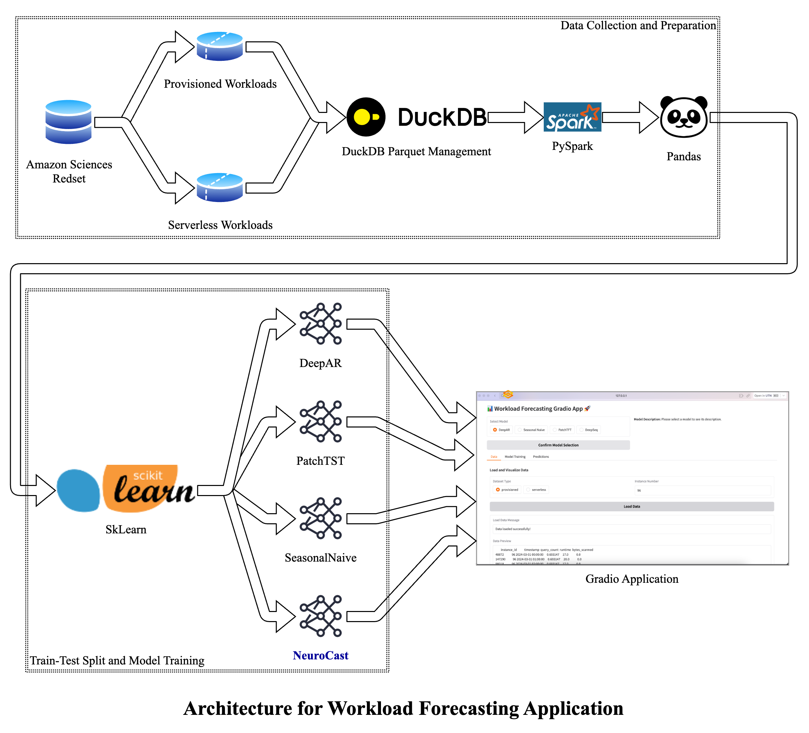

# NeuroCast - Workload Forecasting
NeuroCast - Workload Forecasting is a system that predicts workload patterns in Amazon Redshift clusters. It examines query surges, execution times, and resource usage by combining multiple baseline models with deep learning techniques. The primary objective is to enable autonomous resource allocation in Redshift clusters, thereby enhancing cost-efficiency and system performance.

This project utilizes the dataset available here: [Redset information](https://github.com/amazon-science/redset)

## Features
- A user-friendly interface built on gradIO for loading data, training models, and making predictions.
- Options to select specific instances for workload forecasting.
- Comprehensive visualizations for both pre-trained analysis and prediction results.
- Supports four different models: DeepAR, NeuroCast, Naiveseasonal, and PatchTST.
- Provides a comparative analysis of model results using various error metrics.
- Optimized for instances with high workload volumes.

## How to use
- Clone the repository to your local machine.
- Open the project folder in your code editor and run the main.py to launch the application. Alternatively, run the workload_forecasting.ipynb notebook to view the machine learning model output.
- Select the model you wish to use for forecasting.
- Load the data and choose the visualization option to see the distribution of the three metrics: query counts, bytes scanned, and execution time.
- Pick the instance for which you want to forecast results.
- Train the chosen model and then click on the predict button to view the forecast for the next week.
- Visualize the prediction error metrics and values directly within the application.

## Installation
To install the required dependencies and set up the App Engine environment, run the following commands in your terminal:

```bash
git clone https://gitos.rrze.fau.de/utn-machine-intelligence/teaching/ml-ws2425-final-projects/g8.git
```

- For a Python pip environment:
```bash
python -m venv ./env
source env/bin/activate
pip install -r piprequirements.txt
```

- For Conda environments:
```bash
conda create --name myenv python=3.10 -y
conda activate myenv
while read requirement; do conda install --yes $requirement || pip install $requirement; done < requirements.txt
```

## Running the application
Follow these steps to run the Workload Forecasting Gradio App:
```bash
venv\Scripts\activate
cd ./g8
python -m main.py
```
The application will be accessible locally at: http://127.0.0.1:7860

## Project Architecture


## License
This project is licensed under the **Internal Use License**.  

For more details, see the [LICENSE](LICENSE) file.

**Note:** This license has been formulated by the repository maintainer and does not represent an official university license.
